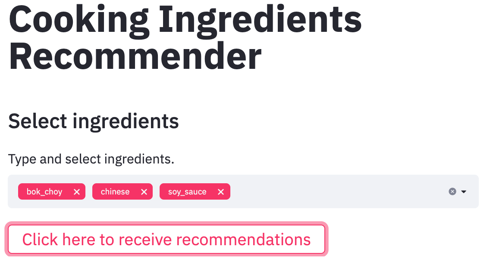
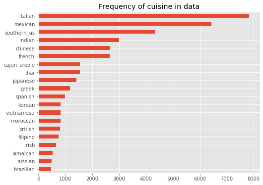

# Cooking Ingredients Recommendation 
This project builds a cooking ingredients recommender. It takes existing ingredients as input and outputs complementary ingredients. 

To view the final app, please visit this website: <a href="http://18.222.227.112:8501/">http://18.222.227.112:8501/</a> 

## Project Summary 

### 1. Problem statement
* Include "business impact"
* buisness problems and products that can benefit from a similar type of analysis 

### 2. Data 
This project uses Kaggle's <a href="https://www.kaggle.com/kaggle/recipe-ingredients-dataset/">Recipe Ingredients Dataset</a>, which consists of around 40,000 documents (recipes). Each document consists of a list of ingredients for a specific recipe.   

#### Noteable preprocessing steps
1. Remove stop words (ingredients): I removed the most-frequently occurring ingredient "salt" from the dataset. 
2. Balancing training dataset: As shown in the following chart, the dataset is biased. There is an imbalanced representation of cuisine type. I used oversampling and understampling to create a more balanced training set. 

Please view the "data_preprocessing.ipynb" notebook for details.  

### 3. Methods  
* Model: I built a recommender that takes a list of 5 ingredients as input and outputs a list of 6 complementary ingredients.  
* Metrics: Precision@k, Recall@k, F1@k for k=6
* Methods  
	* For the final product, I used <b>multi-label classification</b> using a shallow neural network. 
	* I also explored building the recommender based on the following methods: 
		* Market basket analysis (association rule mining) 
		* Non-negative matrix factorization
		* word embeddings
		* CBOW (Continuous Bag Of Words model) 
		* One can find performances of recommenders based on these methods in the Jupyter notebooks.
* Performance (ADD performance of multi-label classification on test set) 

### 4. Product

### 5. Future versions 
